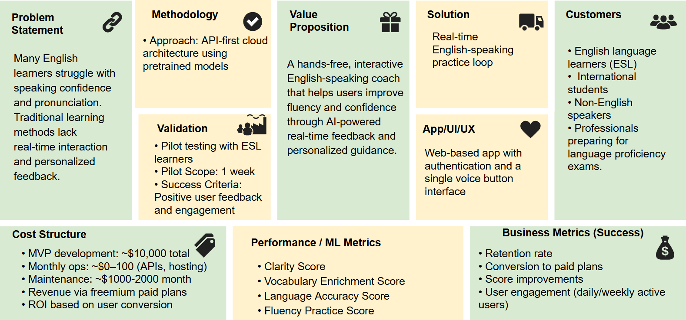
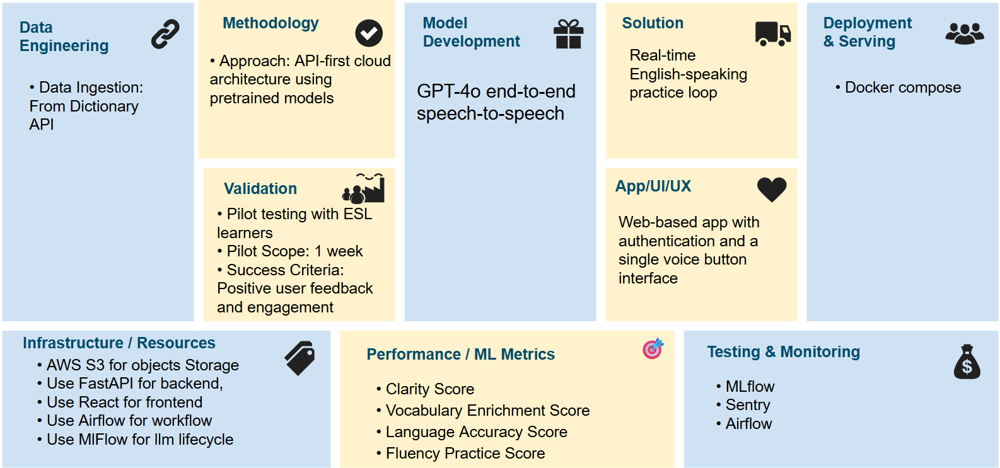
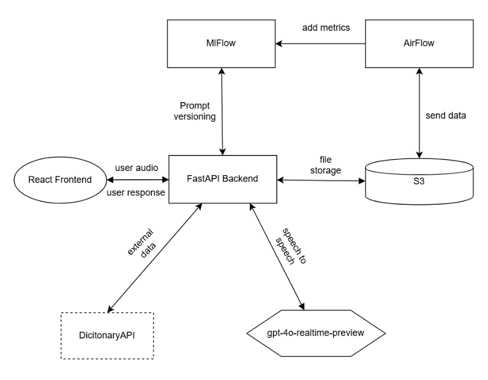

# Langlish - Real-time English Teaching Voice Assistant

## Description

Langlish is a real-time English learning voice assistant that uses OpenAI's speech-to-speech technology to provide immersive and interactive language practice. Learners can speak naturally and receive immediate spoken feedback, corrections, and guidance from an AI English tutor. Langlish helps expand vocabulary by offering clear explanations, contextual usage, and interactive conversation, making learning new words intuitive and engaging.

## ML Product Design



## ML System Design



## ML System Architecture



## Requirements

- Real-time speech-to-speech communication
- OpenAI Real-time API integration
- Conversational English learning
- Grammar corrections and vocabulary help
- Natural voice interaction with audio processing
- Modern web interface with React and TypeScript
- FastAPI backend with WebSocket support
- **AWS S3 integration for audio storage** - Save and archive conversation audio files
- **MLflow integration** for experiment tracking
- **Apache Airflow** for workflow orchestration

## Prerequisites

### Required

- Python 3.11 or higher
- Node.js 18 or higher
- npm or pnpm package manager
- [uv](https://github.com/astral-sh/uv) package manager (recommended for backend)
- OpenAI API key with Real-time API access
- FFmpeg (for audio processing)

### Optional

- AWS account (for audio storage)
- Docker and Docker Compose (for containerized setup)
- At least 4GB RAM (6GB+ recommended for full stack with Airflow)

## Quick Start

### Option 1: Local Development Setup

#### Step 1: Clone the Repository

```bash
git clone https://github.com/fdgbatarse1/langlish.git
cd langlish
```

#### Step 2: Install FFmpeg

**Ubuntu/Debian:**

```bash
sudo apt update && sudo apt install ffmpeg
```

**macOS:**

```bash
brew install ffmpeg
```

**Windows:**
Download from [ffmpeg.org](https://ffmpeg.org/download.html) or use Chocolatey:

```bash
choco install ffmpeg
```

#### Step 3: Set up Environment Variables

Create a `.env` file in the root directory:

```bash
# For Docker setup (if using)
AIRFLOW_UID=$(id -u)  # On Linux, use your actual user ID

# Airflow default credentials (change in production)
_AIRFLOW_WWW_USER_USERNAME=admin
_AIRFLOW_WWW_USER_PASSWORD=admin
```

#### Step 4: Backend Setup

1. Navigate to the backend directory:

```bash
cd backend
```

2. Install uv (if not already installed):

```bash
curl -LsSf https://astral.sh/uv/install.sh | sh
```

3. Create virtual environment and install dependencies:

```bash
uv venv
source .venv/bin/activate  # On Windows: .venv\Scripts\activate
uv pip install -e .
```

4. Create backend `.env` file:

```bash
cat > .env << EOF
# OpenAI Configuration (REQUIRED)
OPENAI_API_KEY=your_openai_api_key_here

# AWS S3 Configuration (OPTIONAL - for audio storage)
AWS_ACCESS_KEY_ID=your_aws_access_key_id_here
AWS_SECRET_ACCESS_KEY=your_aws_secret_access_key_here
AWS_S3_BUCKET_NAME=your_s3_bucket_name_here
AWS_S3_REGION=us-east-1

# MLflow Configuration (automatically configured if using Docker)
# MLFLOW_TRACKING_URI=http://localhost:5000
EOF
```

For detailed AWS S3 setup instructions, see [backend/AWS_S3_SETUP.md](backend/AWS_S3_SETUP.md).

#### Step 5: Frontend Setup

1. Navigate to the frontend directory:

```bash
cd ../frontend
```

2. Install dependencies:

```bash
npm install
# or
pnpm install
```

#### Step 6: Run the Application

1. Start the backend server (in backend directory):

```bash
cd ../backend
source .venv/bin/activate  # On Windows: .venv\Scripts\activate
python -m uvicorn main:app --reload
```

2. In a new terminal, start the frontend (in frontend directory):

```bash
cd frontend
npm run dev
# or
pnpm dev
```

3. Open your browser and navigate to `http://localhost:5173`

### Option 2: Docker Setup (Recommended for Full Stack)

1. Ensure Docker and Docker Compose are installed
2. Create necessary `.env` files as described above
3. Run the entire stack:

```bash
# Start all services (Backend, Frontend, MLflow, Airflow)
docker compose up -d

# Or start only Backend and Frontend
docker compose up backend frontend -d

# View logs
docker compose logs -f
```

Access the services:

- Frontend: http://localhost:5173
- Backend API: http://localhost:8000
- API Documentation: http://localhost:8000/docs
- MLflow UI: http://localhost:5000
- Airflow UI: http://localhost:8080 (username: admin, password: admin)

For detailed Docker setup, see [DOCKER_SETUP.md](DOCKER_SETUP.md).

## Usage

1. **Start a conversation**: Click the blue microphone button
2. **Speak naturally**: Ask questions, practice conversation, or request help
3. **Stop recording**: Click the red button
4. **Listen and learn**: Hear Langlish's response and continue the conversation

## Project Structure

```
langlish/
├── backend/              # FastAPI backend with WebSocket support
│   ├── main.py          # Application entry point
│   ├── src/             # Source code
│   ├── tests/           # Backend tests
│   └── README.md        # Backend-specific documentation
├── frontend/            # React frontend application
│   ├── src/             # React components and logic
│   ├── public/          # Static assets
│   ├── dist/            # Build output
│   └── README.md        # Frontend-specific documentation
├── lifecycle/           # MLflow experiment tracking
│   └── README.md        # MLflow setup guide
├── airflow/             # Apache Airflow workflows
│   ├── dags/            # DAG definitions
│   └── README.md        # Airflow setup guide
├── docker-compose.yml   # Multi-service Docker configuration
├── DOCKER_SETUP.md      # Docker setup instructions
├── README.md            # This file
└── LICENSE              # Project license
```

## Development

### Backend Development

```bash
cd backend
pytest                    # Run tests
mypy .                    # Type checking
ruff check .              # Linting
ruff format .             # Formatting
```

### Frontend Development

```bash
cd frontend
npm run test              # Run tests
npm run lint              # Linting
npm run type-check        # Type checking
npm run build             # Build for production
```

## Troubleshooting

### Common Issues

#### 1. Microphone Access Denied

- Ensure browser has microphone permissions
- Check system privacy settings
- For production, HTTPS is required for microphone access

#### 2. WebSocket Connection Failed

- Verify backend is running on port 8000
- Check for firewall or proxy blocking WebSocket connections
- Ensure frontend environment variables are correct

#### 3. FFmpeg Not Found

- Verify FFmpeg is installed: `ffmpeg -version`
- Ensure FFmpeg is in your system PATH
- Restart terminal after installation

#### 4. OpenAI API Errors

- Verify your API key has Real-time API access
- Check API key is correctly set in backend/.env
- Monitor OpenAI API status page for outages

#### 5. Docker Memory Issues

- Increase Docker memory allocation (minimum 4GB)
- Run fewer services: `docker compose up backend frontend -d`
- Check Docker Desktop settings

### Getting Help

1. Check service logs:

   - Backend: Check terminal output or `docker compose logs backend`
   - Frontend: Check browser console
   - Docker: `docker compose logs -f [service-name]`

2. Verify service health:

   - Backend: http://localhost:8000/health
   - Frontend: http://localhost:5173
   - MLflow: http://localhost:5000
   - Airflow: http://localhost:8080/health

3. For more help, see individual service READMEs in their respective directories.

## Contributing

1. Fork the repository
2. Create a feature branch (`git checkout -b feature/amazing-feature`)
3. Make your changes
4. Add tests if applicable
5. Run the development checks
6. Commit your changes (`git commit -m 'Add amazing feature'`)
7. Push to the branch (`git push origin feature/amazing-feature`)
8. Open a Pull Request

## License

This project is licensed under the MIT License - see the [LICENSE](LICENSE) file for details.
